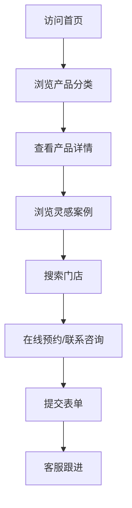
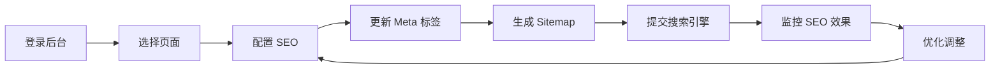

# 卫浴外贸综合网页 - 产品需求文档

## 1. 产品概述

面向全球市场的卫浴外贸综合展示网站，以 Jaquar 为参考范例，打造高端、专业、国际化的品牌形象。网站集产品展示、品牌故事、技术创新、灵感画廊于一体，支持多语言切换，后台配备完整的 SEO 运营工具，方便运营团队进行搜索引擎优化和数据追踪。

核心价值：
- 展示卫浴产品的高端品质与创新技术
- 提供丰富的灵感案例和设计趋势
- 建立完善的经销商网络和服务体系
- 支持全球市场的多语言、多币种运营

## 2. 核心功能模块

### 2.1 用户角色

| 角色 | 描述 | 核心权限 |
|------|------|----------|
| 访客 | 全球潜在客户 | 浏览产品、查看案例、联系咨询 |
| 管理员 | 运营团队 | 产品管理、SEO配置、内容编辑、数据分析 |

### 2.2 功能模块

1. **首页** - 品牌展示、核心产品、价值主张、精选案例
2. **产品中心** - 分类展示、产品详情、技术参数
3. **灵感画廊** - 设计案例、风格分类、设计师故事
4. **品牌故事** - 公司介绍、技术创新、可持续发展
5. **经销商网络** - 门店查询、在线预约、联系方式
6. **客户服务** - 常见问题、技术支持、售后服务
7. **SEO 管理后台** - Meta 标签、URL 管理、Sitemap、结构化数据

## 3. 页面详情

| 页面名称 | 模块名称 | 功能描述 |
|---------|---------|----------|
| 首页 | Hero 区域 | 全屏背景视频/图片轮播，品牌 Slogan，核心 CTA 按钮 |
| 首页 | 产品分类导航 | 淋浴、浴室、照明等核心产品线快速入口 |
| 首页 | 技术创新展示 | 节水、智能控制、高级饰面、可持续制造的特色展示 |
| 首页 | 精选案例 | 灵感画廊精选作品，瀑布流布局，支持查看详情 |
| 首页 | 品牌价值 | 公司简介、质量承诺、环保理念 |
| 首页 | 门店查询 | 地图定位、搜索功能、联系方式 |
| 首页 | 社交媒体 | Instagram 动态、YouTube 视频集成 |
| 产品中心 | 产品列表 | 分类筛选、搜索、排序、分页加载 |
| 产品中心 | 产品详情 | 高清图片画廊、视频介绍、技术参数表、相关产品 |
| 灵感画廊 | 案例列表 | 风格分类、空间分类、设计师分类 |
| 灵感画廊 | 案例详情 | 全屏图片、视频解说、设计理念、材料清单 |
| 品牌故事 | 关于我们 | 公司历史、发展里程碑、全球布局 |
| 品牌故事 | 技术创新 | 核心技术介绍、专利展示、研发实力 |
| 经销商网络 | 门店地图 | 交互式地图、门店详情、预约功能 |
| 客户服务 | 常见问题 | FAQ 分类、搜索、智能回复 |
| 客户服务 | 联系我们 | 在线表单、客服热线、邮箱、地址 |
| SEO 后台 | 页面管理 | 所有页面的 Meta 标题、描述、关键词配置 |
| SEO 后台 | Sitemap | 自动生成 XML Sitemap，支持手动更新 |
| SEO 后台 | 结构化数据 | Schema.org 标记配置、商品数据、面包屑导航 |
| SEO 后台 | SEO 报告 | 页面性能评分、搜索引擎收录情况、关键词排名 |

## 4. 核心流程

### 4.1 访客浏览流程



### 4.2 SEO 运营流程



## 5. 用户界面设计

### 5.1 设计风格

**整体定位**：高端、现代、专业、国际化

**色彩方案**：
- 主色调：深蓝色 `#1a365d` - 传递专业、信任
- 辅助色：银灰色 `#718096` - 现代、高端
- 强调色：金色 `#d69e2e` - 奢华、品质
- 背景色：纯白 `#ffffff` 和浅灰 `#f7fafc`
- 文字色：深灰 `#2d3748`、中灰 `#4a5568`

**字体选择**：
- 标题字体：`Playfair Display` - 优雅、品质
- 正文字体：`Inter` - 现代、清晰
- 中文备选：`Noto Sans SC` - 专业、可读

**按钮风格**：
- 圆角按钮，半透明背景
- Hover 状态：背景加深，轻微上移
- 主要 CTA：金色填充，白色文字
- 次要 CTA：透明边框，深色文字

**图标风格**：
- 线性图标，2px 描边
- SVG 矢量格式，支持颜色变化
- 悬停动画：轻微放大，颜色过渡

**布局风格**：
- 桌面端：网格布局，12 栏系统
- 大量留白，内容分区清晰
- 卡片式产品展示
- 瀑布流案例展示

### 5.2 首页设计

| 模块名称 | 布局 | 样式 | 动效 |
|---------|------|------|------|
| Hero 区域 | 全屏 | 视频背景 + 渐变遮罩 | 文字淡入，CTA 按钮弹入 |
| 产品导航 | 横向滚动 | 卡片式，悬停放大 | 卡片悬停缩放 + 阴影加深 |
| 技术展示 | 四宫格 | 图标 + 文字说明 | 滚动进入时依次淡入 |
| 精选案例 | 瀑布流 | 图片 + 标题 | 图片懒加载，悬停显示详情 |
| 门店地图 | 左图右文 | 地图 + 列表 | 地图交互，列表悬停高亮 |
| Footer | 全宽 | 多栏链接 | 社交图标悬停动画 |

### 5.3 响应式设计

- **桌面端**（1200px+）：完整布局，多栏展示
- **平板端**（768px-1199px）：两栏布局，简化导航
- **移动端**（< 768px）：单栏布局，汉堡菜单，触摸优化

## 6. SEO 运营功能（核心需求）

### 6.1 页面级 SEO 配置

每个页面支持配置：
- Meta Title（最多 60 字符）
- Meta Description（最多 160 字符）
- Meta Keywords（最多 5 个关键词）
- Open Graph 标签（Facebook、LinkedIn）
- Twitter Card 标签
- Canonical URL
- robots 指示（index、follow）

### 6.2 URL 结构

```
/products/[category]/[product-slug]
/inspiration/[style]/[case-slug]
/about
/contact
/dealers
```

### 6.3 技术 SEO

- 自动生成 XML Sitemap（包含优先级和更新频率）
- 自动生成 HTML Sitemap
- 结构化数据支持：
  - Organization
  - Product
  - BreadcrumbList
  - LocalBusiness
  - FAQPage
- 自动生成 robots.txt
- 页面性能优化（Core Web Vitals）
- 图片 Alt 标签管理
- 面包屑导航

### 6.4 内容 SEO

- 内部链接建议系统
- 热门关键词提示
- 竞争对手关键词分析（基础版）
- 内容质量评分
- 重复内容检测

## 7. 性能指标目标

- Lighthouse 性能评分：90+
- First Contentful Paint：< 1.5s
- Largest Contentful Paint：< 2.5s
- Cumulative Layout Shift：< 0.1
- Time to Interactive：< 3s
