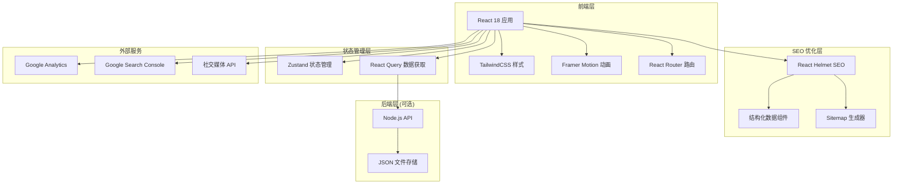
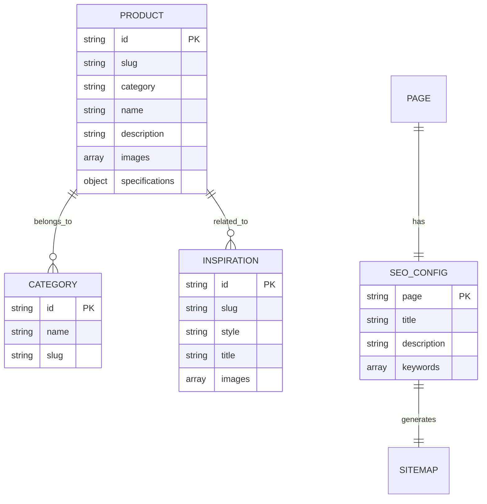

# 卫浴外贸综合网页 - 技术架构文档

## 1. 架构设计



## 2. 技术选型

### 2.1 前端技术栈

- **框架**：React 18.2+
- **构建工具**：Vite 5.x
- **路由管理**：React Router DOM 6.x
- **样式方案**：TailwindCSS 3.x
- **动画库**：Framer Motion 11.x
- **状态管理**：Zustand 4.x
- **数据获取**：React Query 5.x
- **SEO 组件**：React Helmet Async 2.x
- **图标库**：Lucide React
- **字体**：Google Fonts（Playfair Display + Inter）

### 2.2 数据层

- **本地数据**：JSON 文件（产品、案例、配置）
- **图片资源**：本地存储 / CDN
- **SEO 配置**：JSON 配置文件

### 2.3 SEO 工具

- **Meta 标签**：React Helmet Async
- **Sitemap**：react-router-sitemap
- **结构化数据**：自定义 JSON-LD 组件
- **性能监控**：Web Vitals

## 3. 路由定义

| 路由路径 | 页面名称 | SEO 标题 | 描述 |
|---------|---------|----------|------|
| / | 首页 | {品牌名} - 高端卫浴解决方案 | 品牌首页，产品展示 |
| /products | 产品中心 | 产品中心 - {品牌名} | 所有产品列表 |
| /products/:category | 产品分类 | {分类名} - {品牌名} | 分类产品列表 |
| /products/:category/:slug | 产品详情 | {产品名} - {品牌名} | 产品详细信息 |
| /inspiration | 灵感画廊 | 灵感画廊 - {品牌名} | 设计案例展示 |
| /inspiration/:style/:slug | 案例详情 | {案例名} - 灵感画廊 | 案例详细信息 |
| /about | 品牌故事 | 关于我们 - {品牌名} | 公司介绍 |
| /contact | 联系我们 | 联系我们 - {品牌名} | 联系方式 |
| /dealers | 经销商网络 | 经销商网络 - {品牌名} | 门店查询 |
| /admin | SEO 后台 | SEO 管理后台 | SEO 配置管理 |

## 4. 数据模型

### 4.1 产品数据

```typescript
interface Product {
  id: string;
  slug: string;
  category: 'showers' | 'bathroom' | 'lighting';
  name: string;
  nameEn: string;
  description: string;
  descriptionEn: string;
  images: string[];
  specifications: Record<string, string>;
  features: string[];
  seo: {
    title: string;
    titleEn: string;
    description: string;
    descriptionEn: string;
    keywords: string[];
  };
  createdAt: string;
  updatedAt: string;
}
```

### 4.2 灵感案例数据

```typescript
interface Inspiration {
  id: string;
  slug: string;
  style: 'modern' | 'classic' | 'minimalist';
  title: string;
  titleEn: string;
  description: string;
  descriptionEn: string;
  images: string[];
  designer: string;
  location: string;
  seo: {
    title: string;
    titleEn: string;
    description: string;
    descriptionEn: string;
    keywords: string[];
  };
}
```

### 4.3 SEO 配置数据

```typescript
interface SEOConfig {
  page: string;
  path: string;
  title: string;
  titleEn: string;
  description: string;
  descriptionEn: string;
  keywords: string[];
  ogImage: string;
  canonical: string;
  robots: 'index, follow' | 'noindex, follow' | 'index, nofollow';
}
```

### 4.4 ER 关系图



## 5. SEO 实现方案

### 5.1 动态 Meta 标签

使用 React Helmet Async 为每个页面设置动态 Meta 标签：

```tsx
<Helmet>
  <title>{pageTitle}</title>
  <meta name="description" content={pageDescription} />
  <meta name="keywords" content={keywords} />
  <link rel="canonical" href={canonicalUrl} />
  <meta property="og:title" content={ogTitle} />
  <meta property="og:description" content={ogDescription} />
  <meta property="og:image" content={ogImage} />
  <meta property="og:type" content="website" />
</Helmet>
```

### 5.2 结构化数据

支持以下 Schema.org 类型：

- **Organization**：公司信息、品牌标识
- **Product**：产品信息、价格、评分
- **BreadcrumbList**：面包屑导航
- **LocalBusiness**：经销商信息、地址
- **FAQPage**：常见问题

### 5.3 Sitemap 生成

自动生成包含以下信息的 XML Sitemap：

- 所有产品页面
- 所有案例页面
- 静态页面（关于、联系等）
- 更新频率（changefreq）
- 优先级（priority）

### 5.4 SEO 后台功能

| 功能 | 描述 | 技术实现 |
|------|------|----------|
| 页面列表 | 显示所有可配置 SEO 的页面 | React Table + 路由配置 |
| Meta 编辑 | 可视化编辑 Title、Description、Keywords | 表单组件 |
| 批量编辑 | 批量更新多个页面的 SEO 配置 | Excel 导入 |
| Sitemap 管理 | 一键生成、下载、提交 Sitemap | 自动化脚本 |
| SEO 预览 | 模拟搜索引擎结果展示 | 模板预览 |
| 数据导出 | 导出 SEO 配置为 CSV/JSON | 数据转换 |

## 6. 性能优化策略

### 6.1 代码级优化

- **路由懒加载**：React.lazy + Suspense
- **图片优化**：WebP 格式、响应式图片 srcset
- **代码分割**：按页面/组件分割
- **Tree Shaking**：移除未使用的代码
- **CSS 优化**：TailwindCSS purge

### 6.2 加载优化

- **首屏优化**：Critical CSS 内联
- **图片懒加载**：Intersection Observer
- **预加载**：<link rel="preload">
- **预连接**：DNS Prefetch

### 6.3 运行时优化

- **状态管理**：Zustand 轻量级方案
- **数据缓存**：React Query 缓存策略
- **动画性能**：GPU 加速、will-change

## 7. 项目结构

```
bathroom-website/
├── public/
│   ├── images/          # 图片资源
│   ├── videos/          # 视频资源
│   └── robots.txt      # 爬虫协议
├── src/
│   ├── components/      # 公共组件
│   │   ├── layout/     # 布局组件
│   │   ├── seo/         # SEO 组件
│   │   └── ui/          # UI 组件
│   ├── pages/           # 页面组件
│   ├── data/            # 静态数据
│   │   ├── products.json
│   │   ├── inspirations.json
│   │   └── seo-config.json
│   ├── hooks/           # 自定义 Hooks
│   ├── utils/           # 工具函数
│   ├── styles/          # 全局样式
│   ├── App.tsx
│   └── main.tsx
├── .env                 # 环境变量
├── tailwind.config.js
├── vite.config.ts
└── package.json
```

## 8. 开发工作流

### 8.1 开发阶段

1. 克隆项目，安装依赖
2. 配置环境变量
3. 启动开发服务器：`npm run dev`
4. 修改数据文件（JSON）
5. 实时预览更改

### 8.2 SEO 配置流程

1. 编辑 `src/data/seo-config.json`
2. 运行 `npm run generate:sitemap`
3. 提交到 Google Search Console
4. 监控 Search Console 效果

### 8.3 部署流程

1. 构建生产版本：`npm run build`
2. 测试构建结果
3. 部署到托管平台（Vercel / Netlify）
4. 配置自定义域名
5. 设置 HTTPS

## 9. 部署建议

### 9.1 推荐平台

- **Vercel**：自动部署、全球 CDN、SEO 友好
- **Netlify**：静态网站托管、表单处理
- **GitHub Pages**：免费托管

### 9.2 CDN 配置

- 图片使用 Cloudflare 或阿里云 CDN
- 静态资源设置长期缓存策略
- 启用 Gzip / Brotli 压缩

### 9.3 监控配置

- Google Analytics：流量分析
- Google Search Console：SEO 监控
- Lighthouse CI：性能监控
- Sentry：错误追踪
